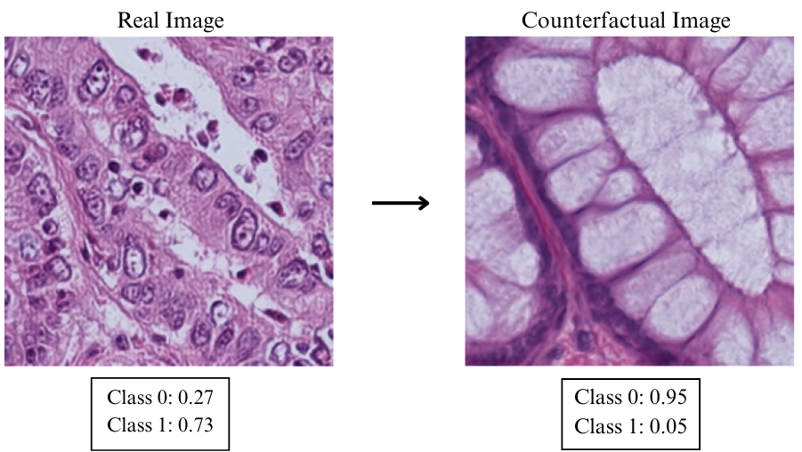
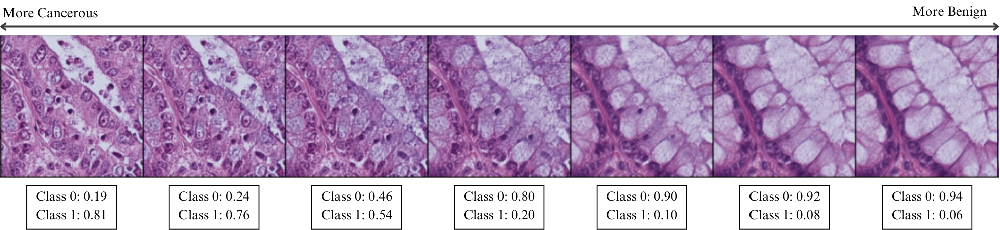

# HistoXplaining in Style: Counterfactual Explanations for Histopathology Images using StyleGAN2-ADA

This repository implements a StyleGAN2-based method for generating counterfactual explanations in histopathology images. By manipulating specific latent directions in the latent space, our approach provides interpretable explanations for diagnostic decisions in medical imaging.

## Abstract

Deep learning-based models have achieved high accuracy in histopathology and are a valuable support tool for medical specialists, helping them enhance diagnostic accuracy, obtain objective results, and reach faster diagnoses. However, their lack of transparency, or black-box nature, raises concerns as it reduces trust in the models’ predictions. Explainable Artificial Intelligence (XAI) provides tools to make black-box models more transparent and understandable for pathologists, thus improving reliability in critical tasks such as histopathological diagnosis. We present HistoXplaining in Style, a method that leverages a StyleGAN2-ADA based aproach to create high-fidelity synthetic histopathology images as counterfactual explanations for image classification tasks. In particular, our method enables highly efficient generation of counterfactual images compared to state-of-the-art approaches, being 72 times faster, while maintaining high visual quality with an FID of 16.2. A remarkable finding is that the intermediate latent space of the generative model organizes tissue features in a semantically meaningful way, clearly separating benign from cancerous phenotypes. In a validation study involving 13 medical experts, we show the realism of our generated images and the clinical utility of the counterfactual explanations. Notably, 92.3\% of experts rated them as "very" or "extremely useful" for understanding and trusting the AI's predictions. Thus, by combining XAI counterfactual explanations and generative models, we provide a potential tool for improving the interpretability and trust of AI in histopathology.

<p align="center">
  
</p>
<p align="center">
  
</p>

<!-- <p align="center">
  
</p> -->

## Key Features

- **Conditional StyleGAN2-ADA**: Generate histopathology images conditioned on diagnostic labels
- **Counterfactual Explanations**: Transform images between diagnostic classes while preserving tissue structure
- **Diversity Counterfactuals**: Show different counterfactual images from one initial image
- **Latent Space Analysis**: Discover meaningful directions for diagnostic feature manipulation
- **UMAP Visualization**: Explore the latent space distribution of generated samples

## Requirements

### Dependencies
```bash
# PyTorch with CUDA support
pip install torch torchvision torchaudio --index-url https://download.pytorch.org/whl/cu122

# Required packages
pip install lmdb tqdm wandb umap-learn matplotlib
pip install ninja-build  # For custom CUDA operations

# Additional analysis tools
pip install scikit-learn pillow numpy
```

### Hardware Requirements
- GPU with 16GB+ VRAM recommended for training (We use one NVIDIA TESLA V100)
- CUDA 12.2+ support

### Conditional Training
```bash
python code/train.py <dataset_path> \
    --arch StyleEx \
    --batch 16 \
    --output_path <output_dir> \
    --classifier_ckpt <model.pth> \
    --wandb \
    --cgan \
    --classifier_nof_classes 2
```

### Continue from Checkpoint
```bash
python code/train.py <dataset_path> \
    --ckpt <checkpoint.pt> \
    --arch stylegan2 \
    --batch 16
```

## Evaluation

### Calculate FID Score
1. Extract Inception features:
```bash
python code/calc_inception.py <dataset_path> --filter_label <label_name>
```

2. Compute FID:
```bash
python code/fid.py --inception <inception_file.pkl> <gan_checkpoint>
```

## Jupyter Notebook Analysis

The main analysis workflow is demonstrated in `notebooks/HistoXplaining_Algorithm.ipynb`, which includes:

- Loading pre-trained conditional StyleGAN2-ADA models
- Generating latent vectors and corresponding images
- UMAP visualization of the latent space
- Classifier-guided counterfactual generation
- Interactive analysis of diagnostic features
- Heatmap visualization of image differences

## Usage Examples

### Interactive Analysis
Load the Jupyter notebook to explore:
- Latent space visualization with UMAP
- Interactive counterfactual generation
- Diagnostic feature highlighting
- Interpolation between diagnostic classes

use the data available in the repository below.

## Data Availability
All trained models (.pt) and images (.lmdb) used for model training are available in this google drive repository [google drive repository](https://drive.google.com/drive/folders/1tFFotKA2dO4SxSRdPEcyf6LAjuttlQUg?usp=sharing). Also you can use the original dataset [NCT-CRC-HE-100K](https://zenodo.org/records/1214456).

## Acknowledgments

- The authors acknowledge the financial support from ANID PIA/APOYO AFB230003, Proyecto Interno UTFSM-DGIIE PI\_LII\_25\_06. Powered@NLHPC: This research was partially supported by the supercomputing infrastructure of the NLHPC (CCSS210001).
- This repo is also a Pytorch version reimplementation of the [Chexplaining in Style](https://github.com/CAMP-eXplain-AI/Style-CheXplain) and [Explaining in Style](https://github.com/google/explaining-in-style) paper repos. 
